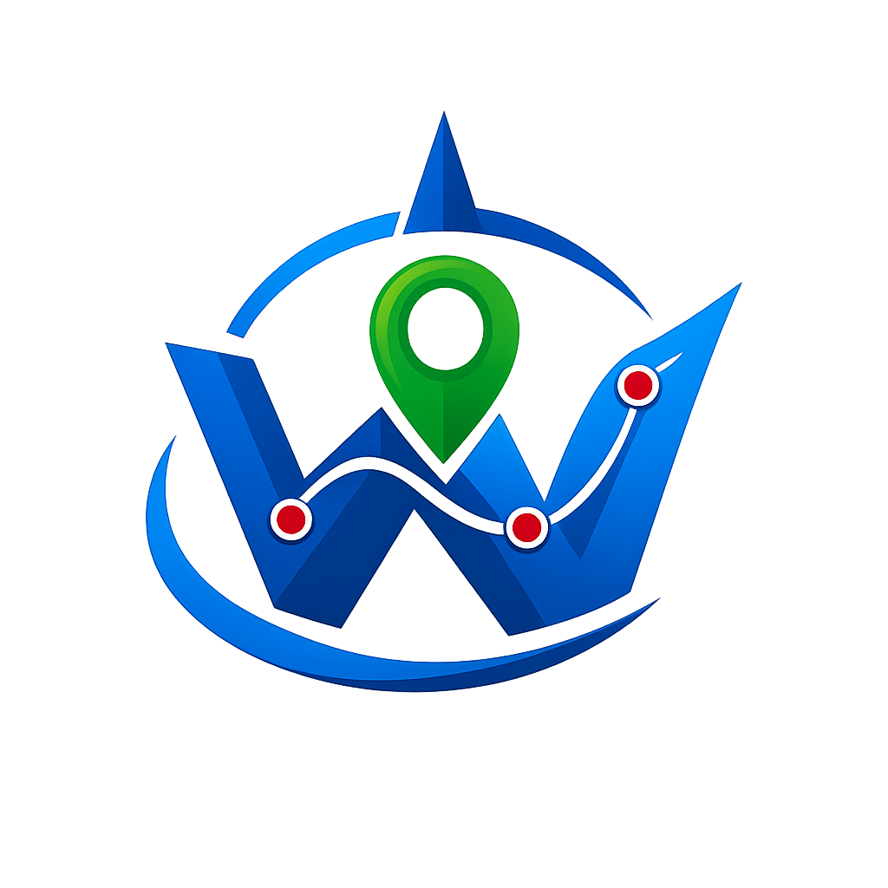

WayPoint is a **free**, waypoint planner for DJI Fly missions. Build flight plans in the browser, fine tune every waypoint, and export DJI-compatible KMZ files without a backend. Requires the [DJI Waypoint Flight feature](https://support.dji.com/help/content?customId=en-us03400007343&spaceId=34&re=US&lang=en&documentType=artical&paperDocType=paper) on your aircraft.

## Mission
Deliver a fast, privacy-first mission planner that runs entirely in the browser and keeps pilots in control of their data.

**Free to use, no accounts, no server.** Everything runs locally in the browser.

## Features
- Map-based waypoint editing: click to add, drag to move, drag handles to reorder.
- Draw tools: line, polygon, ellipse with spacing, resolution, and orientation controls.
- Image-overlap mode for polygon and ellipse to auto-set spacing and add photo waypoints.
- Per-waypoint settings: altitude, speed, heading, gimbal pitch/roll, hover time, camera action, zoom.
- Batch edit, nudge, offset, and reverse waypoint sequences.
- Path modes: straight or curved (DJI Fly KMZ).
- Flight stats: total distance and time using per-waypoint speeds.
- Import and export: DJI Fly KMZ, KML, CSV, plus drag-and-drop import.
- Terrain correction: target AGL with optional max altitude cap.
- Altitude badges with unit toggle (metric or imperial).

## Usage
1. Open `index.html` or the deployed GitHub Pages site.
2. Click the map to add waypoints or use the draw tools.
3. Edit waypoint settings in the list or apply batch edits.
4. Export as DJI Fly KMZ and import into the DJI Fly app.

## Local development
This is a static site. Any simple server works:

```bash
python -m http.server 8080
```

Then open http://localhost:8080 in your browser.

## Data and privacy
All computations run in the browser. Mission files are loaded locally and are not uploaded to a server. Map tiles and optional terrain correction require an internet connection.

## Safety & disclaimer
WayPoint is not affiliated with or endorsed by DJI. You are responsible for safe operation, pre-flight checks, and compliance with local laws and regulations. Fly with caution and use at your own risk.

## Supported drones
- [DJI Mini 5 Pro](https://www.dji.com/mini-5-pro)
- [DJI Mini 4 Pro](https://www.dji.com/mini-4-pro)
- [DJI Air 3](https://www.dji.com/air-3)
- [DJI Air 3S](https://www.dji.com/air-3s)
- [DJI Mavic 3](https://www.dji.com/mavic-3)
- [DJI Mavic 3 Classic](https://www.dji.com/mavic-3-classic)
- [DJI Mavic 3 Pro](https://www.dji.com/mavic-3-pro)
- [DJI Mavic 4 Pro](https://www.dji.com/mavic-4-pro)
